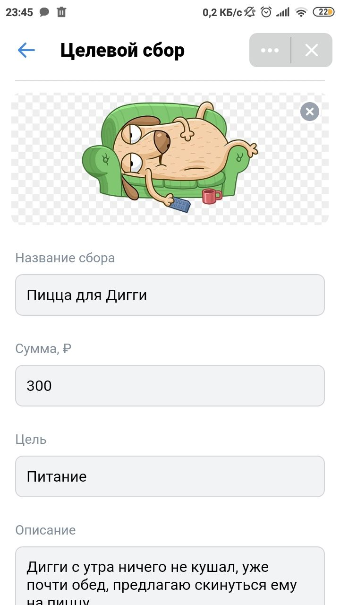
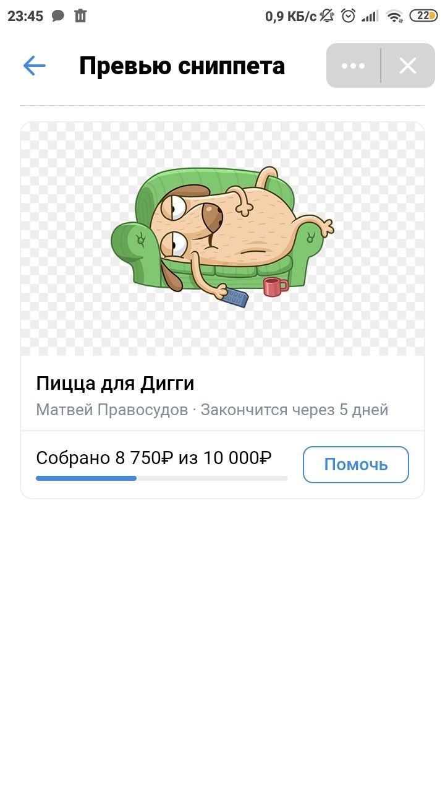
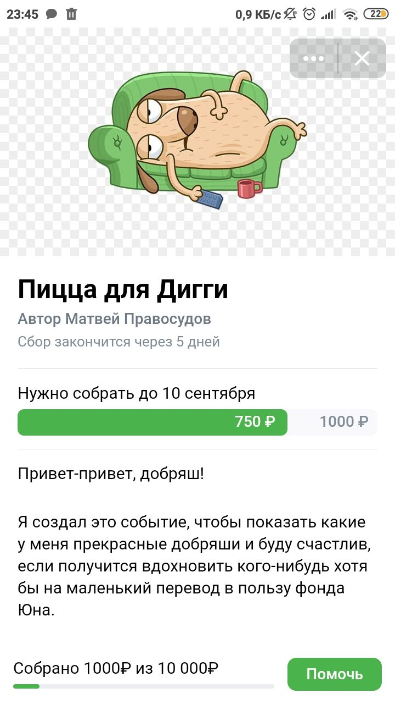

# ❗ Информация для проверяющих

Привет! Данное приложение сделано с использованием React + VKUI библиотеки. 
Особенно сильно в разработке помогла официальная группа [мини-аппов](https://vk.com/vkappsdev).

Ссылка на GithubPages: [https://danilstoyanov.github.io/charityweb/](https://danilstoyanov.github.io/charityweb/)

# Поддерживаемые платформы
* VK MINI APP (Desktop + Mobile IOS + Mobile Android)
* m.vk.com
* десктоп

# Реализованные фичи
* Сверстаны все экраны что были в дизайне. 
* Работает добавление картинки для акции. 
* Можно самостоятельно выбрать название акции. 
* На страничке с постом зафиксирована плашка для сбора средств, при клике помочь увеличивается кол-во собранных средств. 

# Несколько скриншотов

